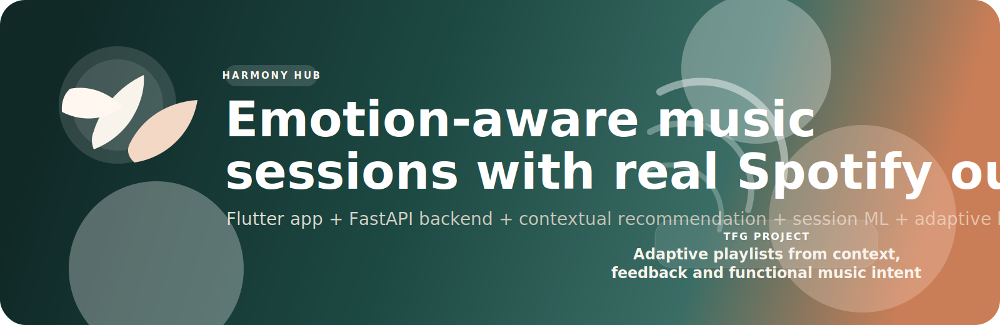
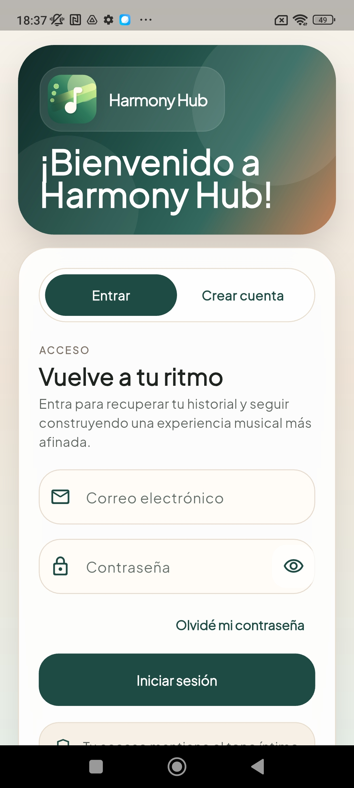
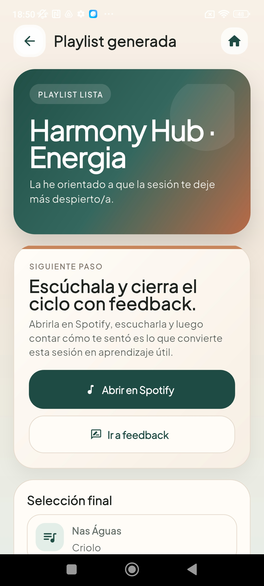

# Harmony Hub

<p align="center">
  
</p>

<p align="center">
  
</p>

[](harmonyhub/)
[](backend_fastapi/)
[](firebase.json)
[](backend_fastapi/app/api/routes/spotify.py)
[](backend_fastapi/app/ml/)
[](LICENSE)

Aplicacion movil y backend inteligente para generar playlists adaptativas en Spotify a partir del estado emocional del usuario, su contexto ambiental y un modelo hibrido de recomendacion con aprendizaje progresivo.

> Harmony Hub convierte un check-in emocional breve en una sesion musical contextual, explicable y reproducible en Spotify.

## De un vistazo

- recomendacion musical sensible a estado emocional, energia, estres y entorno
- generacion de playlists reales en Spotify, no solo sugerencias abstractas
- aprendizaje progresivo del perfil del usuario a partir de feedback
- clasificador supervisado a nivel de sesion para ajustar la seleccion del modo
- memoria academica completa del TFG incluida en el mismo repositorio

## Descripcion

Harmony Hub es un Trabajo Fin de Grado que combina:

- captura de estado emocional
- medicion de ruido ambiental
- recomendacion musical contextual
- generacion automatica de playlists reales en Spotify
- feedback posterior del usuario
- aprendizaje adaptativo a nivel de perfil y de sesion
- ranking hibrido de heuristicas y machine learning

El objetivo del sistema es ofrecer una experiencia musical personalizada, explicable y sensible al momento concreto de uso.

## Objetivo del proyecto

Harmony Hub busca diseñar e implementar un sistema capaz de:

1. registrar el contexto emocional del usuario
2. interpretar factores como energia, estres y ruido ambiental
3. generar recomendaciones musicales adaptadas al momento actual
4. transformar la recomendacion en una playlist real de Spotify
5. aprender progresivamente del feedback
6. combinar reglas heuristicas con un clasificador supervisado a nivel de sesion

## Arquitectura general

```text
harmonyhub/           Frontend Flutter
backend_fastapi/      Backend FastAPI + catalogo + ML + Spotify
tfg_documentacion/    Memoria del TFG en LaTeX
firestore.rules       Reglas de seguridad de Firestore
```

## Estructura del repositorio

- `harmonyhub/`: aplicacion movil Flutter.
- `backend_fastapi/app/`: logica principal del backend, recomendacion, Spotify, Firestore y servicios de aprendizaje.
- `backend_fastapi/app/ml/`: pipeline supervisado, artefactos del modelo y metadatos de auditoria.
- `backend_fastapi/tools/`: utilidades manuales de auditoria, verificacion e importacion del catalogo.
- `backend_fastapi/tests/`: pruebas automatizadas del backend.
- `tfg_documentacion/`: memoria academica, anexos y figuras del TFG.

## Puntos fuertes del proyecto

- **Contexto antes que popularidad**: la recomendacion parte del momento actual del usuario y no solo de listas genericas.
- **Pipeline completo**: check-in, recomendacion, playlist real, escucha, feedback y aprendizaje quedan conectados de extremo a extremo.
- **Modelo prudente**: el componente supervisado no actua siempre, sino solo cuando supera puertas minimas de datos, calidad y confianza operativa.
- **Trazabilidad**: el proyecto conserva auditoria tecnica, documentacion academica y material de defensa para explicar decisiones y resultados.

## Vista rapida de la app

<p align="center">
  
  
  
  
</p>

Estas capturas resumen el recorrido principal: acceso, entrada al check-in,
recomendacion contextual y materializacion de la playlist final.

## Funcionalidades principales

### App Flutter

- autenticacion de usuario
- check-in emocional y contextual
- medicion opcional del entorno acustico
- visualizacion de recomendacion
- generacion de playlist real
- envio de feedback
- historial, perfil y aprendizaje

### Backend FastAPI

- recomendacion de sesion basada en contexto
- modelo supervisado de seleccion de modo
- aprendizaje del perfil del usuario
- catalogo musical local tipo MSD
- materializacion de canciones en Spotify
- mantenimiento y auditoria del modelo
- utilidades manuales de importacion y verificacion en `backend_fastapi/tools/`

### Documentacion del TFG

- memoria academica completa
- diagramas
- anexos tecnicos
- manuales y material de defensa

## Flujo funcional resumido

1. El usuario inicia sesion.
2. Realiza un check-in emocional.
3. La app recoge preferencias y, si se desea, senales del entorno.
4. El backend genera una recomendacion contextual.
5. El usuario puede materializarla como playlist real en Spotify.
6. Tras escucharla, envia feedback.
7. El sistema actualiza el aprendizaje y mantiene el modelo supervisado.

## Stack tecnologico

- Flutter
- FastAPI
- Firebase Authentication
- Cloud Firestore
- Spotify Web API
- scikit-learn

## Puesta en marcha

### Backend

```bash
cd backend_fastapi
python3 -m venv .venv
source .venv/bin/activate
pip install -r requirements.txt
uvicorn app.main:app --host 0.0.0.0 --port 8000
```

### Frontend

```bash
cd harmonyhub
flutter pub get
flutter run
```

## Tests

Backend:

```bash
cd backend_fastapi
source .venv/bin/activate
python -m unittest discover -s tests
```

Frontend:

```bash
cd harmonyhub
flutter test
```

## Documentacion relevante

- [backend_fastapi/CATALOG_SUMMARY_REPORT.md](backend_fastapi/CATALOG_SUMMARY_REPORT.md)
- [backend_fastapi/tools/README.md](backend_fastapi/tools/README.md)
- [tfg_documentacion/](tfg_documentacion/)

## Nota sobre configuracion local

En este estado del proyecto, el cliente Flutter puede apuntar a una IP local concreta para probar en movil fisico. Si cambias de red o de IP, revisa:

- [harmonyhub/lib/core/network/api_client.dart](harmonyhub/lib/core/network/api_client.dart)

## Antes de publicar o clonar

Este repositorio deja fuera secretos y configuraciones sensibles como:

- `backend_fastapi/.env`
- `backend_fastapi/firebase-service-account.json`

Si otra persona quiere ejecutar el proyecto, debera crear sus propias credenciales y configuracion local.

## Licencia

Este repositorio incluye licencia MIT en [LICENSE](LICENSE).
