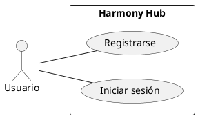
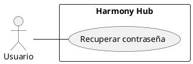
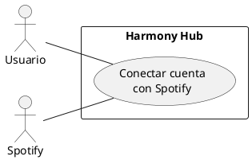
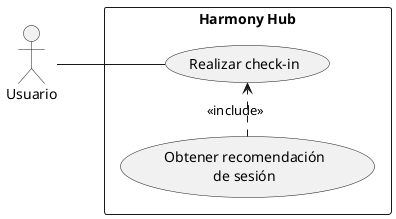
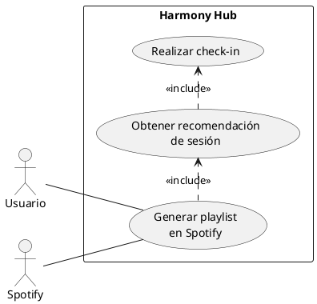
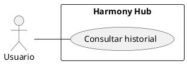
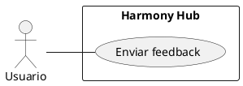
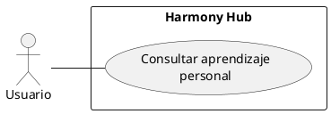

# Guía de casos de uso importantes y diagrama de clases general

Este documento reúne dos cosas que, en un TFG como el tuyo, suelen dar bastante
solidez:

- el detalle de los `casos de uso más importantes` del sistema;
- un `diagrama de clases general` que enseñe cómo se organiza la app a nivel de
  software.

La idea no es dibujar absolutamente todo, porque eso suele producir figuras
cargadas y poco defendibles. La idea, más bien, es representar lo importante
de forma clara, honesta y coherente con la implementación real de Harmony Hub.

---

## 1. Qué casos de uso merece la pena detallar

Para no dispersarte, yo centraría el detalle en estos casos de uso:

1. `CU1. Registrarse e iniciar sesión`
2. `CU2. Recuperar contraseña`
3. `CU3. Conectar cuenta con Spotify`
4. `CU4. Realizar check-in y obtener recomendación`
5. `CU5. Generar playlist en Spotify`
6. `CU6. Consultar historial`
7. `CU7. Enviar feedback`
8. `CU8. Consultar aprendizaje personal`

No hace falta que metas los ocho como figuras obligatorias en la memoria si ves
que queda excesivo. Pero sí conviene tenerlos preparados, porque luego puedes
elegir cuáles mostrar como figura y cuáles explicar solo en texto.

---

## 2. Código PlantUML para cada caso de uso importante

### CU1. Registrarse e iniciar sesión

---

### CU2. Recuperar contraseña

---

### CU3. Conectar cuenta con Spotify

---

### CU4. Realizar check-in y obtener recomendación

Este es uno de los más importantes de todo el sistema, porque ahí empieza la
parte realmente diferencial de Harmony Hub: no se limita a reproducir música,
sino que intenta entender el momento concreto del usuario.

---

### CU5. Generar playlist en Spotify

Aquí ya aparece la conexión entre la recomendación conceptual y su traducción a
una playlist real reproducible.

---

### CU6. Consultar historial

---

### CU7. Enviar feedback

Este caso de uso es bastante valioso en tu TFG, porque conecta la experiencia
de uso con la parte adaptativa del sistema.

---

### CU8. Consultar aprendizaje personal

---

## 3. Diagrama de clases general

### Cómo te recomiendo enfocarlo

Aquí merece la pena ser bastante cuidadoso. Si intentas meter todas las clases
Flutter, todos los widgets y cada detalle del proyecto, el diagrama se vuelve un
bosque. Y la verdad es que eso no ayuda al lector.

Por eso, para la memoria, lo más razonable es hacer un `diagrama de clases
general por capas o módulos`, centrado en:

- servicios principales;
- modelos de dominio más relevantes;
- componentes de persistencia;
- piezas de seguridad y estado de sesión.

En este caso, el diagrama que te propongo está construido a partir de clases
reales del proyecto, no de nombres inventados:

- `AuthService`
- `SpotifySession`
- `SpotifyService`
- `CheckinService`
- `CheckinFirestoreService`
- `EnvironmentAudioService`
- `EnvironmentAudioProfile`
- `RecommendationService`
- `RecommendationFirestoreService`
- `RecommendationModel`
- `SpotifyPlaylistModel`
- `GeneratedPlaylistFirestoreService`
- `FeedbackService`
- `FeedbackFirestoreService`
- `HistoryFirestoreService`
- `UserLearningFirestoreService`
- `EmotionEncryptionService`
- `PresetMode`
- `PresetModesRepository`
- `ApiClient`

---

## 4. Código PlantUML del diagrama de clases general

La siguiente versión está pensada para que el diagrama crezca `en vertical` y
no tanto en horizontal. Para conseguirlo, he hecho tres ajustes:

- uso de `top to bottom direction`;
- reducción del detalle interno de algunas clases;
- relaciones más limpias y nombres de operaciones resumidos.

```plantuml
@startuml
title Diagrama de clases general de Harmony Hub

top to bottom direction
skinparam classAttributeIconSize 0
skinparam packageStyle rectangle
skinparam linetype ortho
skinparam shadowing false

package "Core" {
  class ApiClient <<utility>> {
    +dio
  }

  class EmotionEncryptionService <<service>> {
    +encryptPayload(uid, payload)
    +decryptPayload(uid, encryptedPayload)
  }
}

package "Autenticación" {
  class AuthService <<service>> {
    +register(...)
    +login(...)
    +logout()
    +sendPasswordReset(...)
  }
}

package "Spotify" {
  class SpotifySession <<state>> {
    +isConnected : bool
    +setConnection(...)
    +clear()
  }

  class SpotifyService <<service>> {
    +connectSpotify()
    +getMyPlaylists(...)
    +generateSpotifyPlaylist(...)
  }

  class SpotifyPlaylistModel <<model>> {
    +id : String
    +name : String
    +description : String?
    +url : String?
    +tracksTotal : int
  }

  class GeneratedPlaylistFirestoreService <<service>> {
    +saveGeneratedPlaylist(...)
  }
}

package "Check-in" {
  class CheckinService <<service>> {
    +createCheckin(...)
  }

  class CheckinFirestoreService <<service>> {
    +saveCheckin(...)
  }

  class EnvironmentAudioService <<service>> {
    +analyzeEnvironment(...)
  }

  class EnvironmentAudioProfile <<model>> {
    +noiseCategory : String
    +environmentContext : String?
    +confidence : double?
    +toPublicFirestoreMap()
  }
}

package "Recomendación" {
  class RecommendationService <<service>> {
    +generateRecommendation(...)
  }

  class RecommendationFirestoreService <<service>> {
    +saveRecommendation(...)
  }

  class RecommendationModel <<model>> {
    +recommendationId : String
    +title : String
    +recommendedMode : String
    +mlEnabled : bool
    +selectionSource : String
  }
}

package "Feedback e historial" {
  class FeedbackService <<service>> {
    +submitFeedback(...)
  }

  class FeedbackFirestoreService <<service>> {
    +saveFeedback(...)
  }

  class HistoryFirestoreService <<service>> {
    +getMyCheckins()
    +getMyRecommendations()
    +getMyFeedback()
    +getMyGeneratedPlaylists()
  }

  class UserLearningFirestoreService <<service>> {
    +getMyLearningProfile()
  }
}

package "Modos rápidos" {
  class PresetMode <<model>> {
    +id : String
    +title : String
    +goal : String
    +suggestedMood : String
    +suggestedOutcome : String
  }

  class PresetModesRepository <<repository>> {
    +getModes()
  }
}

CheckinService ..> ApiClient
RecommendationService ..> ApiClient
SpotifyService ..> ApiClient
FeedbackService ..> ApiClient

AuthService ..> SpotifySession
SpotifyService --> SpotifyPlaylistModel
SpotifyService ..> SpotifySession

CheckinFirestoreService --> EmotionEncryptionService
CheckinFirestoreService --> EnvironmentAudioProfile
EnvironmentAudioService --> EnvironmentAudioProfile

RecommendationService --> RecommendationModel
RecommendationFirestoreService --> RecommendationModel

FeedbackFirestoreService --> EmotionEncryptionService
HistoryFirestoreService --> EmotionEncryptionService

PresetModesRepository --> "*" PresetMode

@enduml
```

---

## 5. Variante todavía más compacta

Si al exportarlo sigue quedando demasiado ancho, esta segunda versión sacrifica
algo de detalle interno, pero suele quedar mucho mejor en una sola página.

```plantuml
@startuml
title Diagrama de clases general de Harmony Hub

top to bottom direction
skinparam classAttributeIconSize 0
skinparam packageStyle rectangle
skinparam linetype ortho
skinparam shadowing false

package "Core" {
  class ApiClient
  class EmotionEncryptionService
}

package "Autenticación" {
  class AuthService
}

package "Spotify" {
  class SpotifySession
  class SpotifyService
  class SpotifyPlaylistModel
  class GeneratedPlaylistFirestoreService
}

package "Check-in" {
  class CheckinService
  class CheckinFirestoreService
  class EnvironmentAudioService
  class EnvironmentAudioProfile
}

package "Recomendación" {
  class RecommendationService
  class RecommendationFirestoreService
  class RecommendationModel
}

package "Feedback e historial" {
  class FeedbackService
  class FeedbackFirestoreService
  class HistoryFirestoreService
  class UserLearningFirestoreService
}

package "Modos rápidos" {
  class PresetMode
  class PresetModesRepository
}

CheckinService ..> ApiClient
RecommendationService ..> ApiClient
SpotifyService ..> ApiClient
FeedbackService ..> ApiClient

AuthService ..> SpotifySession
SpotifyService --> SpotifyPlaylistModel
SpotifyService ..> SpotifySession

CheckinFirestoreService --> EmotionEncryptionService
CheckinFirestoreService --> EnvironmentAudioProfile
EnvironmentAudioService --> EnvironmentAudioProfile

RecommendationService --> RecommendationModel
RecommendationFirestoreService --> RecommendationModel

FeedbackFirestoreService --> EmotionEncryptionService
HistoryFirestoreService --> EmotionEncryptionService

PresetModesRepository --> "*" PresetMode

@enduml
```

---

## 6. Recomendación para la memoria

Si me preguntas cómo lo usaría yo en la entrega, haría esto:

- en `Análisis del problema`:
  - diagrama general de casos de uso;
  - alguna referencia a los casos más importantes.

- en `Diseño de la solución`:
  - diagrama de clases general;
  - diagrama de secuencia principal;
  - diagrama entidad-relación lógico.

Y además, si quieres reforzar el capítulo, puedes mencionar que algunos datos
sensibles no se almacenan en bruto, sino divididos en una capa pública mínima y
una capa privada cifrada, como ocurre con `checkins/checkins_private` y
`feedback/feedback_private`.

Eso, la verdad, te ayuda bastante a defender decisiones de diseño con criterio,
que al final es justo lo que suele valorar una memoria bien hecha.
