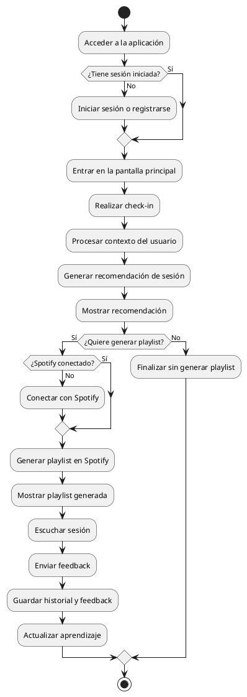

# Guía para el diagrama de actividades del flujo principal

Este documento prepara el `diagrama de actividades` más importante de Harmony Hub:
el que representa el flujo principal de una sesión completa.

La idea es que el diagrama responda a esta secuencia:

`el usuario entra -> define su momento -> recibe una propuesta -> genera una playlist -> escucha -> da feedback -> el sistema aprende`

## 1. Qué debe representar

Este diagrama no es para enseñar arquitectura, sino comportamiento.

Por eso debe mostrar:

- qué hace el usuario
- qué decide el sistema
- en qué puntos hay bifurcaciones
- cómo se cierra la sesión

## 2. Nombre recomendado

Puedes llamarlo:

- `Diagrama de actividades del flujo principal de uso`
- `Flujo principal de generación de sesión musical`

## 3. Alcance recomendado

Haz un único diagrama de actividades para el flujo principal completo.

No te recomiendo hacer diagramas de actividades separados para:

- login
- historial
- recuperación de contraseña

Eso suele añadir ruido y no aporta demasiado en una memoria como la tuya.

## 4. Flujo que te recomiendo dibujar

El flujo base sería este:

1. Inicio
2. Usuario accede a Harmony Hub
3. ¿Tiene sesión iniciada?
4. Si no:
5. Inicia sesión o se registra
6. Accede a la pantalla principal
7. Realiza check-in
8. El sistema procesa el contexto
9. El sistema genera recomendación de sesión
10. El usuario revisa la recomendación
11. ¿Quiere convertirla en playlist?
12. Si sí:
13. El sistema conecta con Spotify
14. El sistema genera la playlist
15. El usuario escucha la sesión
16. El usuario envía feedback
17. El sistema guarda feedback e historial
18. El sistema actualiza aprendizaje
19. Fin

## 5. Decisiones que sí merece la pena incluir

### Decisión 1

`¿Tiene sesión iniciada?`

Sirve para representar que el flujo puede pasar por autenticación antes de entrar a
la experiencia principal.

### Decisión 2

`¿Spotify está conectado?`

Esta bifurcación sí tiene sentido en tu app, porque la generación de playlist real
depende de que exista conexión previa con Spotify.

### Decisión 3

`¿Quiere generar la playlist?`

Esto te ayuda a mostrar que la recomendación y la playlist no son exactamente la
misma cosa: primero hay una propuesta de sesión y después una materialización en
Spotify.

## 6. Flujo visual recomendado

En `Draw.io`, yo lo organizaría de arriba abajo.

### Zona 1. Acceso

- Inicio
- Acceder a la app
- decisión: `¿Tiene sesión iniciada?`
- si no: `Iniciar sesión / registrarse`

### Zona 2. Check-in y recomendación

- Realizar check-in
- Procesar contexto
- Generar recomendación
- Mostrar recomendación

### Zona 3. Playlist

- decisión: `¿Quiere generar playlist?`
- decisión: `¿Spotify conectado?`
- si no: `Conectar con Spotify`
- Generar playlist
- Mostrar playlist

### Zona 4. Cierre de ciclo

- Escuchar sesión
- Enviar feedback
- Guardar historial
- Actualizar aprendizaje
- Fin

## 7. Qué texto poner dentro de cada actividad

Usa verbos claros, no títulos abstractos.

Buenos ejemplos:

- `Acceder a la aplicación`
- `Iniciar sesión`
- `Realizar check-in`
- `Procesar contexto del usuario`
- `Generar recomendación`
- `Conectar con Spotify`
- `Crear playlist`
- `Escuchar sesión`
- `Enviar feedback`
- `Actualizar aprendizaje`

Evita etiquetas como:

- `Sistema`
- `Proceso`
- `Datos`
- `Motor`

porque no explican realmente qué está pasando.

## 8. Qué estilo te recomiendo

Si lo haces en `Draw.io`:

- actividades: rectángulos redondeados
- decisiones: rombos
- inicio y fin: círculos negro / doble círculo
- flechas simples y limpias

No metas demasiados colores. Si quieres usar color:

- azul suave o verde suave para actividades del usuario
- beige o gris suave para actividades del sistema

Pero también queda bien completamente en blanco y negro si está bien ordenado.

## 9. Versión lista para PlantUML

## 10. Versión un poco más académica

Si quieres que se vea más formal, puedes sustituir algunos nodos por estos nombres:

- `Validar autenticación del usuario`
- `Capturar contexto de sesión`
- `Evaluar variables contextuales`
- `Construir recomendación de sesión`
- `Solicitar generación de playlist`
- `Persistir historial de sesión`
- `Incorporar feedback al aprendizaje`

Mi recomendación, sinceramente, es no abusar de esta versión si el diagrama va
dentro de una memoria que ya tiene bastante texto. Lo más valioso es que se lea
rápido.

## 11. Mi recomendación final

Haz este diagrama como el más importante del capítulo de análisis.

Si el diagrama de casos de uso enseña `qué puede hacer el usuario`, este enseña
`cómo ocurre realmente la experiencia`.

Y en Harmony Hub eso tiene bastante peso, porque una parte grande del valor del
proyecto está precisamente en el encadenamiento de pasos:

- contexto
- interpretación
- propuesta
- reproducción real
- feedback
- aprendizaje

## 12. Pie de figura recomendado

Puedes usar este:

`Diagrama de actividades del flujo principal de uso de Harmony Hub, desde el acceso del usuario hasta el cierre de la sesión mediante feedback y actualización del aprendizaje.`
