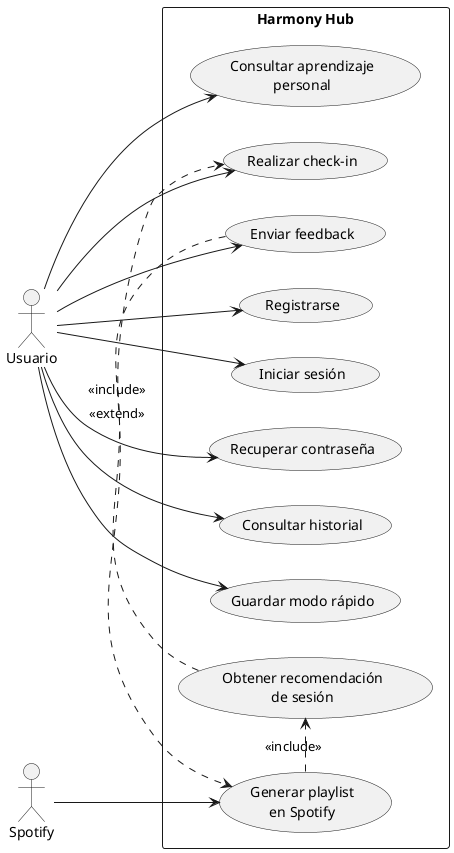

# Guía para el diagrama general de casos de uso

Este documento te deja preparado el contenido del `diagrama general de casos de uso`
de Harmony Hub para que puedas trasladarlo fácilmente a `Draw.io`, `StarUML` o
`PlantUML`.

## 1. Objetivo del diagrama

Este diagrama no debe representar cada pantalla de la app, sino el funcionamiento
global del sistema desde el punto de vista del usuario y de los servicios externos.

La idea es que responda, de un vistazo, a esta pregunta:

`¿Qué puede hacer el usuario dentro de Harmony Hub y con qué elementos externos se relaciona el sistema?`

## 2. Límite del sistema

Dentro del rectángulo del sistema debes poner:

- `Harmony Hub`

Todo lo que ocurra dentro de ese rectángulo son casos de uso propios del sistema.

## 3. Actores

### Actor principal

- `Usuario`

### Actor secundario externo

- `Spotify`

### Actor externo opcional

Solo si quieres más detalle:

- `Firestore / Base de datos`

Mi recomendación real es:

- usa `Usuario`
- usa `Spotify`
- no pongas `Firestore` en este diagrama si ves que lo recarga demasiado

La base de datos suele explicarse mejor en arquitectura o en modelo de datos.

## 4. Casos de uso que debes incluir

Dentro de `Harmony Hub`, yo colocaría estos:

- `Registrarse`
- `Iniciar sesión`
- `Recuperar contraseña`
- `Realizar check-in`
- `Obtener recomendación de sesión`
- `Generar playlist en Spotify`
- `Consultar historial`
- `Guardar modo rápido`
- `Enviar feedback`
- `Consultar aprendizaje personal`

## 5. Relaciones recomendadas

### Asociaciones directas del actor `Usuario`

Conecta `Usuario` con:

- `Registrarse`
- `Iniciar sesión`
- `Recuperar contraseña`
- `Realizar check-in`
- `Consultar historial`
- `Guardar modo rápido`
- `Enviar feedback`
- `Consultar aprendizaje personal`

### Asociación del actor `Spotify`

Conecta `Spotify` con:

- `Generar playlist en Spotify`

Si quieres, también podrías conectarlo con:

- `Iniciar sesión`

Pero yo no lo haría, porque en tu sistema el login principal es de la app y la
conexión con Spotify es una integración posterior, no el acceso principal del
usuario.

### Relaciones entre casos de uso

Usa estas relaciones:

- `Obtener recomendación de sesión` `<<include>>` `Realizar check-in`
- `Generar playlist en Spotify` `<<include>>` `Obtener recomendación de sesión`
- `Enviar feedback` `<<extend>>` `Generar playlist en Spotify`

Justificación:

- no puedes obtener una recomendación sin haber hecho antes el check-in
- no puedes generar la playlist sin una recomendación previa
- el feedback aparece después de la experiencia, así que encaja mejor como `extend`

## 6. Disposición visual recomendada

Para que quede limpio en `Draw.io`, te recomiendo esta colocación:

### A la izquierda del sistema

- `Usuario`

### A la derecha del sistema

- `Spotify`

### Dentro del rectángulo

Fila superior:

- `Registrarse`
- `Iniciar sesión`
- `Recuperar contraseña`

Zona central:

- `Realizar check-in`
- `Obtener recomendación de sesión`
- `Generar playlist en Spotify`

Zona inferior:

- `Consultar historial`
- `Guardar modo rápido`
- `Enviar feedback`
- `Consultar aprendizaje personal`

## 7. Qué poner como título en la memoria

Puedes usar uno de estos:

- `Diagrama general de casos de uso de Harmony Hub`
- `Casos de uso principales del sistema`

Y como pie de figura:

- `Representación de las principales interacciones del usuario con el sistema Harmony Hub y su integración con Spotify.`

## 8. Versión lista para PlantUML

Si quieres partir de texto, puedes usar esto:

## 9. Versión simplificada si el diagrama te queda demasiado cargado

Si lo ves muy lleno, quédate con esta versión reducida:

- `Iniciar sesión`
- `Realizar check-in`
- `Obtener recomendación de sesión`
- `Generar playlist en Spotify`
- `Consultar historial`
- `Enviar feedback`

En un TFG muchas veces menos es más, siempre que el diagrama explique bien el
núcleo de la aplicación.

## 10. Mi recomendación final

Haz primero la `versión simplificada`.

Si al verla sientes que falta contexto, añade:

- `Registrarse`
- `Recuperar contraseña`
- `Guardar modo rápido`
- `Consultar aprendizaje personal`

Pero no empieces por la versión grande si quieres un resultado limpio y fácil de
defender.
