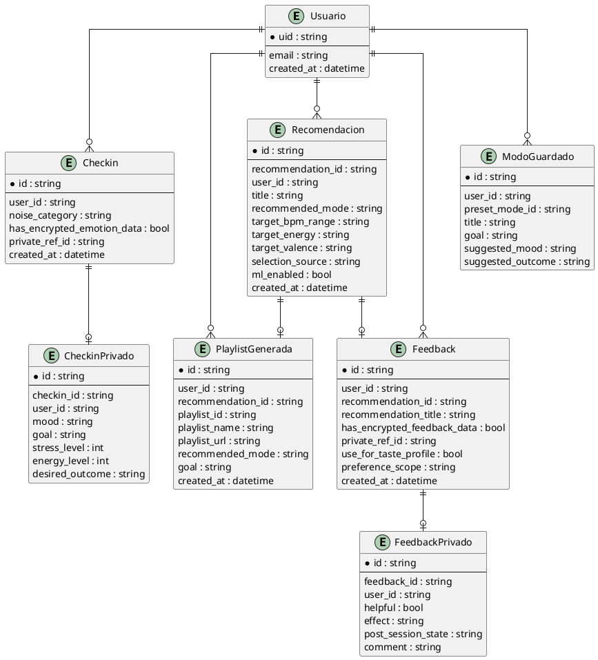
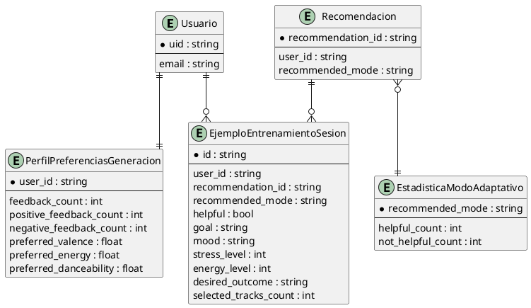

# Guía para el diagrama entidad-relación y diagramas complementarios

Este documento resume qué diagramas adicionales sí merece la pena preparar para
la memoria de Harmony Hub y cómo te recomiendo enfocarlos.

La idea principal es esta:

- no mezclar en un mismo diagrama todo el sistema si eso lo vuelve ilegible;
- distinguir entre el `núcleo funcional` de la app y la `capa de aprendizaje`;
- no hacer un diagrama independiente por cada pequeño detalle de uso si luego el
  texto ya explica lo mismo.

---

## 1. Sobre el diagrama entidad-relación

Sí, en tu caso conviene incluir un diagrama entidad-relación.

Pero con una matización importante: Harmony Hub usa `Firestore`, que es una base
de datos documental y no relacional en sentido clásico. Por eso, el diagrama que
te conviene hacer no es un esquema físico exacto al estilo SQL, sino un
`modelo lógico de entidades y relaciones`.

Eso es perfectamente defendible en un TFG, y además queda mucho más claro para el
lector.

### Mi recomendación

Hazlo en dos niveles:

1. `Diagrama entidad-relación principal`
2. `Diagrama entidad-relación extendido de aprendizaje`

Así no saturas una sola figura.

---

## 2. Diagrama entidad-relación principal

Este es el que debería ir sí o sí en memoria.

### Entidades principales

- `Usuario`
- `Checkin`
- `CheckinPrivado`
- `Recomendacion`
- `PlaylistGenerada`
- `Feedback`
- `FeedbackPrivado`
- `ModoGuardado`

### Relaciones principales

- Un `Usuario` realiza `muchos Checkin`
- Un `Checkin` puede estar asociado a `un bloque privado CheckinPrivado`
- Un `Usuario` recibe `muchas Recomendacion`
- Una `Recomendacion` puede dar lugar a `una PlaylistGenerada`
- Un `Usuario` genera `muchas PlaylistGenerada`
- Una `Recomendacion` puede recibir `cero o un Feedback`
- Un `Usuario` emite `muchos Feedback`
- Un `Feedback` puede estar asociado a `un bloque privado FeedbackPrivado`
- Un `Usuario` guarda `muchos ModoGuardado`

### Qué atributos sí mostrar

No pongas todos los campos. Solo los importantes.

#### Usuario

- `uid`
- `email`
- `created_at`

#### Checkin

- `id`
- `user_id`
- `created_at`
- `noise_category`
- `has_encrypted_emotion_data`
- `private_ref_id`

#### CheckinPrivado

- `id`
- `checkin_id`
- `user_id`
- `mood`
- `goal`
- `stress_level`
- `energy_level`
- `desired_outcome`

#### Recomendacion

- `id`
- `recommendation_id`
- `user_id`
- `title`
- `recommended_mode`
- `target_bpm_range`
- `target_energy`
- `target_valence`
- `selection_source`
- `ml_enabled`
- `created_at`

#### PlaylistGenerada

- `id`
- `user_id`
- `recommendation_id`
- `playlist_id`
- `playlist_name`
- `playlist_url`
- `recommended_mode`
- `goal`
- `created_at`

#### Feedback

- `id`
- `user_id`
- `recommendation_id`
- `recommendation_title`
- `has_encrypted_feedback_data`
- `private_ref_id`
- `use_for_taste_profile`
- `preference_scope`
- `created_at`

#### FeedbackPrivado

- `id`
- `feedback_id`
- `user_id`
- `helpful`
- `effect`
- `post_session_state`
- `comment`

#### ModoGuardado

- `id`
- `user_id`
- `preset_mode_id`
- `title`
- `goal`
- `suggested_mood`
- `suggested_outcome`

---

## 3. Diagrama entidad-relación extendido de aprendizaje

Este segundo diagrama es opcional, pero en tu TFG puede quedar muy bien porque
explica que la app no solo genera playlists, sino que también aprende.

### Entidades de aprendizaje

- `PerfilPreferenciasGeneracion`
- `EjemploEntrenamientoSesion`
- `EstadisticaModoAdaptativo`

### Relaciones

- Un `Usuario` tiene `un PerfilPreferenciasGeneracion`
- Un `Usuario` puede generar `muchos EjemploEntrenamientoSesion`
- Una `Recomendacion` puede originar `muchos EjemploEntrenamientoSesion`
- Un `recommended_mode` se resume en `una EstadisticaModoAdaptativo`

### Qué atributos mostrar

#### PerfilPreferenciasGeneracion

- `user_id`
- `feedback_count`
- `positive_feedback_count`
- `negative_feedback_count`
- `preferred_valence`
- `preferred_energy`
- `preferred_danceability`
- `excluded_track_ids`

#### EjemploEntrenamientoSesion

- `id`
- `user_id`
- `recommendation_id`
- `recommended_mode`
- `helpful`
- `goal`
- `mood`
- `stress_level`
- `energy_level`
- `desired_outcome`
- `selected_tracks_count`

#### EstadisticaModoAdaptativo

- `recommended_mode`
- `helpful_count`
- `not_helpful_count`

---

## 4. Código PlantUML para el entidad-relación principal

---

## 5. Código PlantUML para el entidad-relación extendido de aprendizaje

---

## 6. ¿Hace falta un diagrama de cada caso de uso?

Mi recomendación honesta es: `no`.

Lo razonable en un TFG como este es:

- `1 diagrama general de casos de uso`
- `fichas textuales de los casos de uso principales`

Eso queda más profesional que hacer un diagrama independiente para cada caso de
uso, porque muchos acabarían siendo repetitivos y visualmente pobres.

### Casos de uso que sí debes detallar uno por uno

- `CU1. Registrarse e iniciar sesión`
- `CU2. Conectar cuenta con Spotify`
- `CU3. Realizar sesión musical contextual`
- `CU4. Consultar historial personal`
- `CU5. Enviar feedback sobre una sesión`
- `CU6. Recuperar contraseña` (opcional, pero recomendable)

### Qué poner en cada ficha

Para cada caso de uso, usa esta estructura:

- `Nombre`
- `Actor principal`
- `Actores secundarios`
- `Precondiciones`
- `Postcondiciones`
- `Flujo principal`
- `Flujos alternativos`

Eso suele ser más útil que otro diagrama.

---

## 7. ¿Qué diagramas de secuencia específicos sí merecen la pena?

Además del diagrama de secuencia principal, yo te recomendaría estos:

### Obligatorio o muy recomendable

- `Secuencia de conexión con Spotify`
  Porque explica muy bien el flujo OAuth y la intervención del backend.

- `Secuencia de envío de feedback y actualización del aprendizaje`
  Porque ahí está una de las partes más diferenciales de Harmony Hub.

### Opcional

- `Secuencia de autenticación y recuperación de contraseña`
  Solo si tu tutor valora mucho los flujos de acceso.

### No recomiendo

- hacer un diagrama de secuencia separado para consultar historial
- hacer uno para guardar modo rápido

Eso normalmente no aporta suficiente valor frente al texto.

---

## 8. Pack de diagramas que yo entregaría

Si quisiera una memoria sólida pero sin sobrecargarla, entregaría este conjunto:

### En análisis

- diagrama general de casos de uso
- diagrama de actividades del flujo principal
- fichas textuales de casos de uso principales

### En diseño

- diagrama de arquitectura
- diagrama entidad-relación principal
- diagrama entidad-relación extendido de aprendizaje
- diagrama de secuencia del flujo principal
- diagrama de secuencia de conexión con Spotify
- diagrama de secuencia de feedback y aprendizaje

Con eso ya tendrías una base muy seria, bastante completa y, además, coherente con
lo que realmente hace el proyecto.
